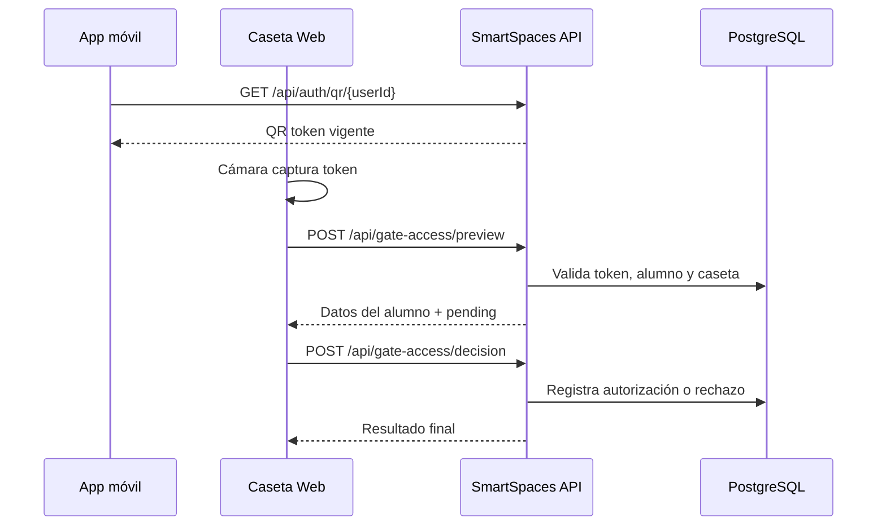

<div align="center">

  

  # SpaceIA · Caseta Web

  **Centro operativo para validar accesos universitarios en tiempo real.**

  Una experiencia web segura para guardias: escanea el QR del estudiante, revisa su identidad y registra la decisión contra SmartSpaces.

  <p>
    
    
    
    
  </p>

  [Inicio rápido](#-inicio-rápido) · [Flujo QR](#-flujo-de-acceso-qr) · [Usuarios](#-usuarios-de-desarrollo) · [API](#-contrato-de-la-api) · [Despliegue](#-despliegue)

</div>

> **Fuente única de verdad:** el frontend no contiene arreglos mock. Dashboard, bitácora, perfil y resultados QR se leen del backend. Las únicas filas iniciales son semillas reproducibles de `Development`.

## ✨ Qué resuelve

| Operación | Resultado |
|---|---|
| **Identificar** | Escanea el QR móvil y consulta los datos reales del alumno. |
| **Decidir** | Modal responsivo para **Autorizar** o **Rechazar**. |
| **Registrar** | Auditoría de guardia, caseta, alumno, fecha y resultado. |
| **Supervisar** | Bitácora y dashboard con el comportamiento general del campus. |

## 🚀 Inicio rápido

**Requisitos:** Node.js 22+, npm 10+, API SmartSpaces disponible y PostgreSQL migrado.

```powershell
npm ci
npm start
```

Abre <http://localhost:4200>. Para ejecutar la API:

```powershell
dotnet run --project SmartSpaces.API/SmartSpaces.API.csproj
```

Comandos de calidad:

```powershell
npm run lint
npm test -- --watch=false
npm run build
```

## 🔐 Flujo de acceso QR



1. La app móvil solicita el QR vigente con `GET /api/auth/qr/{userId}`.
2. El navegador captura el token, pero **no lo descifra ni confía en su contenido**.
3. `POST /api/gate-access/preview` valida firma, expiración, alumno activo y caseta.
4. El guardia confirma con `POST /api/gate-access/decision`.
5. La API persiste `AUTHORIZED` o `ACCESS_DENIED_BY_GUARD`.

## 🧭 Experiencia

- **Inicio:** estado del servicio, resumen del día y accesos recientes.
- **Escáner:** cámara trasera, selector de dispositivo, pausa al cambiar de pestaña, vibración y captura manual.
- **Bitácora:** búsqueda, filtros, orden y paginación del servidor.
- **Dashboard:** análisis general para hoy, 7 o 30 días; vista por día u hora.
- **Perfil:** caseta asignada, tema claro/oscuro y cambio seguro de contraseña.
- **Responsive:** sidebar en laptop, riel en tableta y barra inferior en móvil.

## 🧱 Arquitectura

```text
src/app/
├── core/       modelos, sesión, API, interceptor y guards
├── features/   landing, login, inicio, escáner, bitácora, dashboard y perfil
├── layout/     shell autenticado responsive
└── shared/     iconos, avisos, confirmación y componentes UI
```

| Capa | Tecnología | Responsabilidad |
|---|---|---|
| UI | Angular standalone + SCSS | Vistas, accesibilidad y responsive. |
| Seguridad | JWT + interceptor | Sesión, expiración y manejo de `401`. |
| QR | `@zxing/browser` | Captura y ciclo del escaneo. |
| Datos | SmartSpaces API | Identidad, accesos, bitácora y métricas. |
| Visualización | Chart.js + ng2-charts | Gráfica general sin datos inventados. |

## 👤 Usuarios de desarrollo

`DevelopmentGateSeeder` crea de forma idempotente las cuentas de caseta. **No se ejecuta en producción.** Contraseña temporal de todas: `Caseta#2026!`; deben cambiarla desde Perfil.

| Guardia | Correo | Folio | Caseta |
|---|---|---|---|
| Guardia Principal | `caseta1@spaceai.local` | `CASETA-001` | Caseta Principal |
| Guardia Norte | `caseta2@spaceai.local` | `CASETA-002` | Caseta Norte |
| Guardia Sur | `caseta3@spaceai.local` | `CASETA-003` | Caseta Sur |
| Guardia Estacionamiento | `caseta4@spaceai.local` | `CASETA-004` | Caseta Estacionamiento |
| Guardia Administrativo | `caseta5@spaceai.local` | `CASETA-005` | Caseta Administrativa |

Estudiantes para generar QRs: `alumno@utl.edu.mx`, `juan.rea@utl.edu.mx`, `maria.gomez@utl.edu.mx` y `carlos.lopez@utl.edu.mx`. Contraseña: `SpaceIA2026!`. `lucia.torres@utl.edu.mx` está inactiva para probar un rechazo. **Credenciales solo para desarrollo.**

## 🌐 Configuración de API

| Archivo | Entorno | Base URL |
|---|---|---|
| `src/environments/environment.ts` | Desarrollo | `http://localhost:5043/api` |
| `src/environments/environment.production.ts` | Producción | `https://app-spaceia-api-core.azurewebsites.net/api` |

No guardar secretos, JWT ni credenciales reales en archivos de entorno. La sesión se mantiene en `sessionStorage`; la API es la autoridad de identidad y permisos.

## 📡 Contrato de la API

| Método | Endpoint | Propósito |
|:---:|---|---|
| `POST` | `/api/gate-auth/login` | Autenticar guardia `Caseta`. |
| `GET` | `/api/gate-auth/me` | Perfil y caseta actuales. |
| `POST` | `/api/gate-auth/change-password` | Cambiar contraseña y revocar sesiones. |
| `GET` | `/api/gates/my-gate` | Caseta asignada. |
| `POST` | `/api/gate-access/preview` | Validar QR sin registrar. |
| `POST` | `/api/gate-access/decision` | Persistir autorización o rechazo. |
| `POST` | `/api/gate-access/scan` | Compatibilidad con flujo legado. |
| `GET` | `/api/gate-access/recent` | Accesos recientes. |
| `GET` | `/api/gate-access/today` | Bitácora paginada. |
| `GET` | `/api/gate-access/summary` | Resumen del día. |
| `GET` | `/api/gate-dashboard/overview` | Agregados para la gráfica. |

Todos salvo login requieren `Authorization: Bearer <JWT>`. Guardia y caseta se derivan del JWT y de la asignación persistida.

## 📦 Despliegue

1. Configurar el frontend en `AllowedOrigins` del backend.
2. Ejecutar migraciones PostgreSQL y cargar secretos en la plataforma.
3. Ajustar `apiBaseUrl` si la API usa otro dominio.
4. Compilar con `npm run build`.
5. Publicar `dist/space-ai-caseta-web/browser` con fallback SPA a `index.html`.
6. Servir por **HTTPS**: `getUserMedia` no funciona en HTTP para dispositivos físicos.
7. Verificar que móvil y web apunten al mismo backend y compartan zona horaria/expiración QR.

## 📚 Documentación relacionada

- [Análisis técnico](docs/ANALISIS_TECNICO.md)
- [Reporte final](docs/REPORTE_FINAL.md)
- [Reporte del rediseño](docs/REPORTE_REDISENO.md)
- [Análisis corporativo](docs/ANALISIS_REDISENO_CORPORATIVO.md)

<div align="center"><strong>SpaceIA · Control de acceso confiable, observable y conectado.</strong></div>
